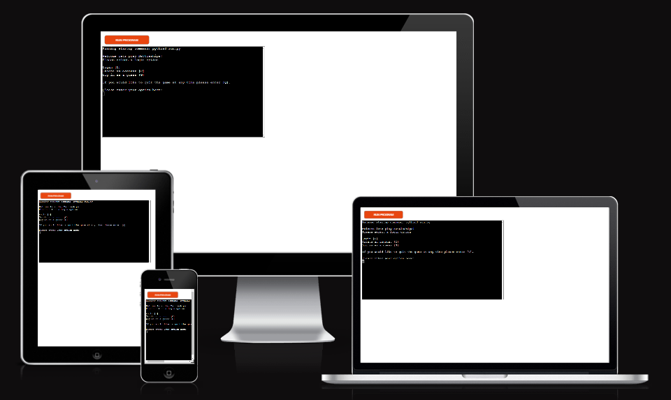
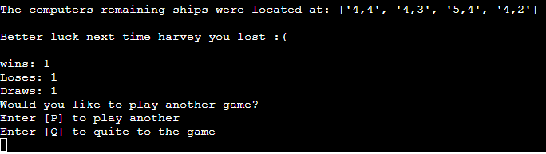

# Battleships!

This game is run in a Python terminal on the Heroku website. 
The aim for the user is to try and locate the computers ships before the computer finds theirs. 

[Please find the live version of this project here.](https://battleships12.herokuapp.com/) 

## The rules
- Battleships is a classic game that has been enjoyed even when it was a simple pencil and paper game. 
- The objective of the game is to sink the other players ships before they sink yours. 
- Each player takes a turn to guess the location where the oppositions ships are hidden. 
- This continues until all a player’s ships have been hit. 
- The winner is the player with ships remaining.  

## Features

- ### Creating and/or logging into existing account
    - This allows players to create an account and choose the username that they wish to be referred to while playing. 
    - Each username is unique so if it has already been taken the player will need to choose a different one. 
    - They also create a password to keep their account secure and will need both username and password to be able to log into an existing account. 
    - There is also a guest option for players who do not wish to have an account.

    

- ### Generating random ship locations
    - The game is set on a 5 by 5 grid and both players start with 5 ships.
    - Each 5 ships are randomly assigned 5 coordinates for each player. 
    - When the game ends either by the user quitting or finishing the game the location of the remaining ships are displayed.

    

- ### Scoring 
    - The results of the game are decided by which player was able to eliminate all the other players ships.
    - If the user has created an account, it will then add one to if the user won/ lost/ drew and will then display the total wins, loses, and draws.

    

- ### Input validation
    - The game will keep a track of which coordinates the players have already fired upon and display a reject message if they enter the same coordinates twice. 
    - The game also checks that two numbers are separated by a comma within the range of 1 to 5 which are the possible coordinates of the board. 

    

- ### User friendly 
    - This game allows the user for to quit the game whenever they choose to no matter where they are within the game.
    - The game will also ask the user if they wish to play again at the end of the game to save being taken back to the start of the code.

    

    - The game also shows the board itself and is updated with the coordinates that have been entered that round.

    

## Flow chart

## Testing

I have manually tested this project by: 
- Checking the validation embedded in the [Code institute org/ python essentials template.](https://github.com/Code-Institute-Org/python-essentials-template)
    - All issues have been resolved baring the 'line too long' but this issue doesn't affect the game.
- Checked the inputs by giving invalid inputs that were: empty inputs, numbers greater than the range, and invalid strings.
- The program was tested in my local terminal and the Code Institute Heroku terminal.

## Libraries used

In this project I used 4 libraries:

- The random library was imported to produce the random numbers for the ship coordinates and to choose the computers next move.
- The time library was imported to use the sleep function to slow the speed of the text being printed.
- The gspread was imported to manipulate the spreadsheet containing the username and passwords and the users scores.
- The google.oauth2.service_account import Credentials was used to connect the code to the Microsoft spreadsheet. 

## Bug

When testing the project, I noticed that sometimes the game wouldn't end even after every coordinate had been fired on. After investigating I discovered the random numbers were generating randomly twice. This explained why the error was not appearing every time I tested the game.

I was able to solve this issue by checking the generated coordinates had not already been generated for that round. I also moved the code into its own function to reduce the repeating code and to incorporate Object-oriented programming method. 

When testing I also found an issue where if the game reached the final few spots on the board the run time would take a while. This was because I had originally set up the computer to randomly generate moves the same way I generated the ship placement. This meant that when there were only a few valid options it would take a long time to randomly land on those unused coordinates. To resolve this issue, I simply gave the computer all the possible moves at the start and let it randomly use and remove the remaining coordinates. This drastically increased the run time for the game in the later stages. 

## Deployment

The project was deployed to Heroku. The steps to deploy the project are as follows:

- [First log into the Heroku website](https://dashboard.heroku.com/apps)
- Click ‘New’ and ‘Create a new app’
- For App name I named my project 'battleships12' and set my region to 'Europe' then clicked 'Create app'
- Then select the 'Settings' tab
- Next I scroll down to 'Config Vars' and click 'Reveal Config Vars'
- In the field for KEY I entered 'CREDS' and in the VALUE field I pasted my 'creds,json' information
- In the next KEY below I added 'PORT' and in VALUE I added '8000'
- Then I scrolled further down to 'Buildpacks' add clicked 'Add buildpacks' 
- I then clicked the 'python' option and 'Save changes'
- I clicked 'Add buildpack' again and this time select 'nodejs' and then 'Save changes'
- I then checked that the order of the buildpacks was 'python' on top then 'nodejs'
- Then select the 'Deploy' tab
- The 'Deployment method' is next and I selected 'GitHub' and confirmed I wanted to connect to GitHub and confirmed my account
- I then searched in the 'Connect to GitHub' repo-name for the name I gave my repository which was 'battleships' and then 'search' and then 'connect'
- Next I scrolled down to Manual deploy and clicked 'Deploy Branch'
- Finally, the message 'Your app was successfully deployed' and I clicked the 'view' button

## Credits

- To complete this project I used Code Institute student template: [python-essentials-template](https://github.com/Code-Institute-Org/python-essentials-template)

- Ideas and knowledge

    - [w3schools](https://www.w3schools.com/)
    - Code institute Diploma in Full Stack Software Development (Common Curriculum) course