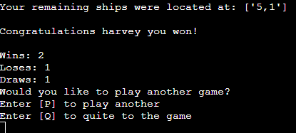

# Battleships!

This game is run in a Python termial on the Heroku website. 
The aim for the user is to try and locate the computers ships before the computer finds theirs. 

[Please find the live version of this project here.](https://battleships12.herokuapp.com/) 

## The rules
- Battleships is a classic game that has been enjoyed even when it was a simple pencil and paper game. 
- To objective of the game is to sink the other players ships before they sink yours. 
- Each player takes a turn to guess the location where the oppositions ships are hidden. 
- This continues until one persons ships have been hit. 
- The winner is the player with ships still remaining. 

## Features

- ### Creating and/or logging into existing account
    - This allows players to create an account and choose the username that they wish to be frefured to while playing. 
    - Each username is unique so if it is already been taken the player will need to choice a different one. 
    - They also create a password to keep there account secure and will need both username and password to be able to log into an existing account. 
    - There is also a guest option for players who don't wish to have an account.

    

- ### Generating random ship locations
    - The game is set on a 5 by 5 grid and both players start with 5 ships.
    - each 5 ships are randomly assigned 5 coordinates for each player. 
    - When the game ends either by the user quitting or finishing the game the location of the remaining ships are displayed.

    

- ### Scoring 
    - The results of the game are decided by which player was able to eliminate all of the other players ships.
    - If the user has created an account it will then add one to if the user won/ lost/ drew and will then display the total wins, loses and draws.

    

- ### Input validation
    - The game will keep a track of which coordinates the players have already fired upon and display a reject message if they enter the same coordinates twice. 
    - The game also checks that two numbers seperated by a commer within the range of 1 to 5, i.e the possible coordinates of the board. 

    

- ### User firendly 
    - This game allows the user for to quit the game whenever they choose to no matter where they are within the game.
    - The game will also ask the user if they wish to play again at the end of the game to save being taken back to the start of the code.

    

## Testing
